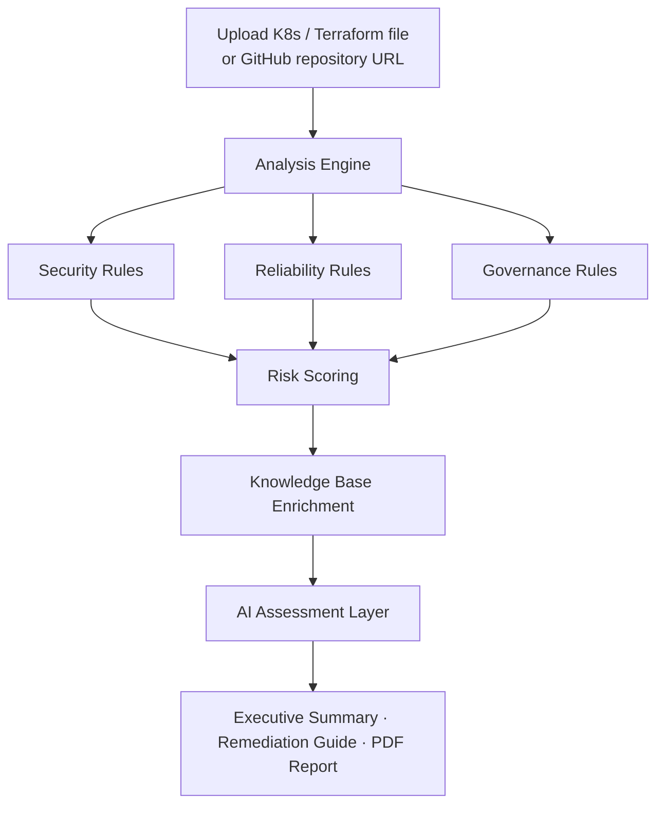

<p align="center">
  <strong>KubeGuardian AI</strong><br>
  <em>AI-Powered Kubernetes & Terraform Governance Platform</em>
</p>

<p align="center">
  <sub><strong>Built with</strong></sub>
</p>

<p align="center">
  <a href="https://www.python.org/" target="_blank" title="Python">
    
  </a>
  &nbsp;
  <a href="https://fastapi.tiangolo.com/" target="_blank" title="FastAPI">
    
  </a>
  &nbsp;
  <a href="https://www.uvicorn.org/" target="_blank" title="Uvicorn">
    
  </a>
  &nbsp;
  <a href="https://kubernetes.io/" target="_blank" title="Kubernetes">
    
  </a>
  &nbsp;
  <a href="https://www.terraform.io/" target="_blank" title="Terraform">
    
  </a>
  &nbsp;
  <a href="https://git-scm.com/" target="_blank" title="Git">
    
  </a>
  &nbsp;
  <a href="https://github.com/" target="_blank" title="GitHub">
    
  </a>
  &nbsp;
  <a href="https://deepmind.google/technologies/gemini/" target="_blank" title="Google Gemini">
    
  </a>
  &nbsp;
  <a href="https://cloud.google.com/" target="_blank" title="Google Cloud Platform">
    
  </a>
</p>

---

## Overview

**KubeGuardian AI** is a cloud-native governance platform that reviews **Kubernetes manifests** and **Terraform infrastructure code** before deployment — surfacing security, reliability, and operational risks early in the delivery pipeline.

Where most scanners stop at raw error lists, KubeGuardian adds **risk scoring**, **context-rich remediation guidance**, **AI-generated executive summaries**, and **shareable PDF reports** — giving DevOps, platform, and security teams a clear picture of infrastructure health without digging through logs or config files.

> **In one line:** Shift-left infrastructure governance — from misconfiguration to actionable fix, in minutes.

---

## Key Highlights

| | |
|---|---|
| **14+ governance checks** | Security, reliability, and IaC best-practice rules across K8s and Terraform |
| **Risk scoring** | Severity-weighted health score (0–100) for quick posture assessment |
| **Knowledge-driven remediation** | Every finding enriched with risk, impact, priority, and recommended fix |
| **AI assessments** | Google Gemini–powered executive summaries and remediation guidance |
| **PDF reporting** | Audit-ready reports for engineering, security, and leadership stakeholders |
| **Repository scanning** | Clone and analyze Terraform files from public GitHub repositories |

**Skills demonstrated:** Python · FastAPI · Kubernetes · Terraform · DevSecOps · AI integration · REST APIs · Infrastructure-as-Code · Technical documentation

---

## The Problem

Infrastructure is managed as code — but a single misconfigured file can introduce:

| Risk | Real-world impact |
|------|-------------------|
| Security vulnerabilities | Exposed workloads, privilege escalation, compliance failures |
| Reliability gaps | Silent failures, no failover, unpredictable scaling |
| Governance drift | Untagged resources, missing state backends, hardcoded settings |
| Late discovery | Issues found in production — expensive and stressful to fix |

Common examples: open security groups, privileged containers, missing health probes, single-replica deployments, and absent Terraform remote state.

**KubeGuardian catches these before they reach production.**

---

## The Solution

KubeGuardian performs **pre-deployment infrastructure reviews** and returns assessments teams can act on immediately.

**What you get from every scan:**

- Prioritized findings (Critical → Low)
- Infrastructure health score
- Risk and impact analysis per finding
- Recommended remediation steps
- AI-generated executive summary
- Downloadable PDF assessment report

---

## How It Works



| Step | What happens |
|------|----------------|
| **1. Input** | Upload a `.yaml` / `.yml` / `.tf` file, or submit a GitHub repo URL |
| **2. Analyze** | Rule engine scans for security, reliability, and governance issues |
| **3. Enrich** | Each finding is scored and paired with risk context and fix guidance |
| **4. Report** | AI summary + structured remediation + PDF export for your team |

---

## Capabilities

### Kubernetes — Security

| Check | Why it matters |
|-------|----------------|
| Privileged containers | Reduces attack surface and blast radius |
| Root user containers | Enforces least-privilege at the pod level |
| Cluster-admin bindings | Prevents excessive RBAC permissions |
| Missing security context | Ensures baseline hardening is applied |
| `:latest` image tags | Improves reproducibility and rollback safety |

### Kubernetes — Reliability

| Check | Why it matters |
|-------|----------------|
| Missing liveness probes | Unhealthy pods restart automatically |
| Missing readiness probes | Traffic only routes to healthy instances |
| Missing resource requests | Enables proper scheduling and capacity planning |
| Missing resource limits | Prevents resource starvation across the cluster |
| Single-replica deployments | Adds resilience against node failures |

### Terraform — Governance

| Check | Why it matters |
|-------|----------------|
| Missing tags | Supports cost allocation, ownership, and compliance |
| Open security groups | Limits unintended public exposure |
| Missing backend configuration | Protects state integrity and team collaboration |
| Hardcoded instance types | Improves flexibility and environment parity |

---

## Risk Assessment Model

Every finding is enriched beyond a pass/fail flag:

| Field | Purpose |
|-------|---------|
| **Severity** | Critical · High · Medium · Low |
| **Priority** | P1–P4 remediation ordering |
| **Risk** | What could go wrong |
| **Impact** | Business and operational consequence |
| **Recommended fix** | Concrete next step |

<details>
<summary><strong>Example finding</strong></summary>

```json
{
  "rule": "OPEN_SECURITY_GROUP",
  "severity": "CRITICAL",
  "priority": "P1",
  "risk": "Public internet exposure",
  "impact": "Attackers can directly access workloads",
  "recommended_fix": "Restrict ingress CIDRs to trusted networks"
}
```

</details>

---

## AI-Powered Assessment

Powered by **Google Gemini**, KubeGuardian translates scan results into language stakeholders actually use.

| Output | Description |
|--------|-------------|
| **Executive summary** | Overall infrastructure health and security posture — concise, non-technical |
| **Remediation guidance** | Root cause context, prioritized actions, and governance improvements |

Designed for standups, sprint reviews, security handoffs, and leadership reporting.

---

## PDF Reporting

Each assessment generates a structured PDF report including:

- Security score and findings breakdown
- Executive summary
- Detailed findings with risk analysis
- Remediation guidance and infrastructure recommendations

Shareable across **DevOps**, **Platform Engineering**, **Security**, and **Leadership** — no extra formatting required.

---

## Example Output

```text
Security Score: 40 / 100

Critical : 1    High : 1    Medium : 2    Low : 1

Top Risks
  • Open security group
  • Missing Terraform remote state backend

Recommended Actions
  • Restrict public network access to trusted CIDR ranges
  • Configure S3 or GCS remote backend for state management
  • Apply mandatory tagging policies (Environment, Owner, Team)
```

---

## Tech Stack

| Layer | Technologies |
|-------|----------------|
| **API & backend** | Python, FastAPI, Uvicorn |
| **Parsing** | PyYAML, python-hcl2 |
| **Repository scanning** | GitPython |
| **AI** | Google Gemini (GenAI SDK) |
| **Reporting** | ReportLab |
| **Configuration** | python-dotenv |

---

## Project Structure

```text
Kubeguardian/
├── backend/
│   ├── app/           # FastAPI application & API routes
│   ├── analyzers/     # Kubernetes & Terraform parsers
│   ├── rules/         # Security, reliability & governance rules
│   ├── scanner/       # GitHub clone & file discovery
│   ├── knowledge/     # Rule metadata & finding enrichment
│   ├── ai/            # Gemini integration & report generation
│   └── reports/       # Summary builder & PDF export
├── docs/              # Sample manifests for testing
├── pdf_reports/       # Generated assessment reports
└── repos/             # Cloned repositories for analysis
```

---

## Roadmap

### Shipped

- [x] Kubernetes manifest analysis (security + reliability)
- [x] Terraform file analysis (governance)
- [x] Severity-weighted risk scoring
- [x] Knowledge-based remediation enrichment
- [x] AI executive summaries and remediation reports
- [x] PDF report generation
- [x] GitHub repository scanning (Terraform)

### In Progress

- [ ] Web UI for uploads and report viewing
- [ ] Kubernetes file discovery in repository scans
- [ ] Docker containerization
- [ ] Cloud deployment (GCP Cloud Run)

### Planned

- [ ] CI/CD pipeline integration (GitHub Actions)
- [ ] Policy-as-code support
- [ ] OPA / Gatekeeper integration
- [ ] Multi-cloud governance expansion

---

## Why KubeGuardian?

| Typical scanners | KubeGuardian AI |
|------------------|---------------|
| List problems | Explain **why** they matter |
| Raw output | **Prioritized**, scored findings |
| Engineer-only | **Executive summaries** for any audience |
| Ephemeral results | **PDF reports** you can share and archive |

By combining rule-based analysis, a structured knowledge layer, and AI-assisted reporting, KubeGuardian helps teams deploy infrastructure with **greater confidence** and **fewer surprises**.

---

<p align="center">
  <strong>Built for DevOps Engineers · SREs · Platform Engineers · Cloud & DevSecOps Teams</strong>
</p>

<p align="center">
  <sub>Portfolio project — Infrastructure governance, shift-left security, and AI-assisted DevOps tooling</sub>
</p>
